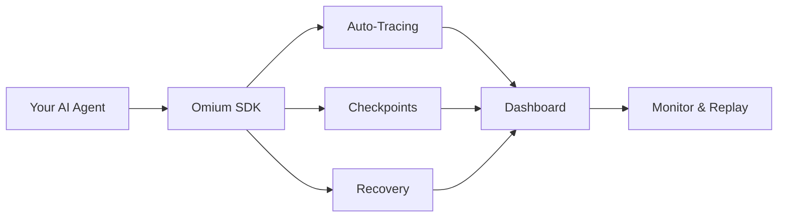

<CardGroup cols={2}>
  <Card
    title="Automatic Tracing"
    icon="chart-line"
    href="/guides/langgraph-integration"
  >
    Auto-instrument your LangGraph or CrewAI workflows with one line of code.
  </Card>
  <Card
    title="Checkpointing & Recovery"
    icon="shield-check"
    href="/api-reference/checkpoints"
  >
    Automatic checkpoints let you resume from failures without losing progress.
  </Card>
  <Card
    title="Framework Agnostic"
    icon="puzzle-piece"
    href="/guides/crewai-integration"
  >
    Works with LangGraph, CrewAI, AutoGen, and any Python AI workflow.
  </Card>
  <Card
    title="Production Dashboard"
    icon="rocket"
    href="https://app.omium.ai"
  >
    Monitor executions, view traces, and replay failed runs from the dashboard.
  </Card>
</CardGroup>

---

## How Omium Works

<Note>
Omium sits between your AI agent framework and the LLM, automatically capturing traces and creating checkpoints for recovery.
</Note>



---

## Quick Start

Get up and running in 3 steps:

### 1. Install the SDK

```bash
pip install omium
```

### 2. Initialize & Instrument

<Tip>
Get your API key from [app.omium.ai/api-keys](https://app.omium.ai/api-keys)
</Tip>

```python
import omium

# Initialize with your API key
omium.init(api_key="omium_xxx")

# Auto-instrument your framework
omium.instrument_langgraph()  # or omium.instrument_crewai()
```

### 3. Run Your Workflow

Your existing code works unchanged:

```python
from langgraph.graph import StateGraph

# Your workflow code runs normally
# Omium automatically captures traces and checkpoints
graph = StateGraph(...)
app = graph.compile()
result = app.invoke({"input": "Hello"})
```

View your execution at [app.omium.ai](https://app.omium.ai)!

---

## Next Steps

<CardGroup cols={2}>
  <Card title="Installation" icon="download" href="/getting-started/installation">
    Install the Omium SDK
  </Card>
  <Card title="Quick Start" icon="rocket" href="/getting-started/quickstart">
    5-minute setup guide
  </Card>
  <Card title="LangGraph" icon="diagram-project" href="/guides/langgraph-integration">
    Integrate with LangGraph
  </Card>
  <Card title="CrewAI" icon="users" href="/guides/crewai-integration">
    Integrate with CrewAI
  </Card>
</CardGroup>
